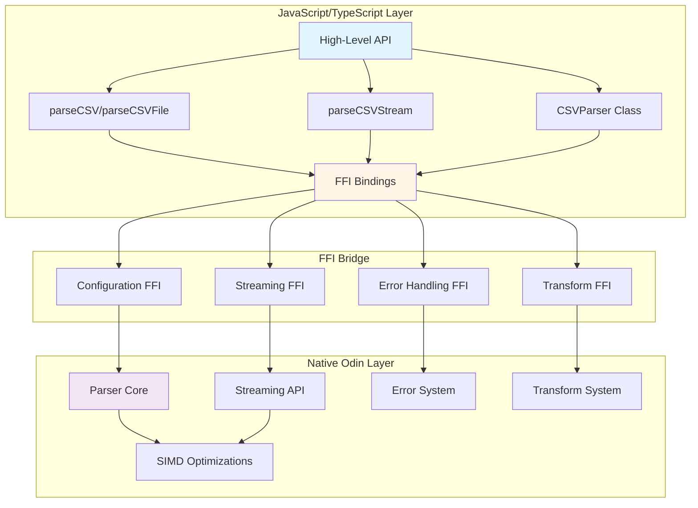
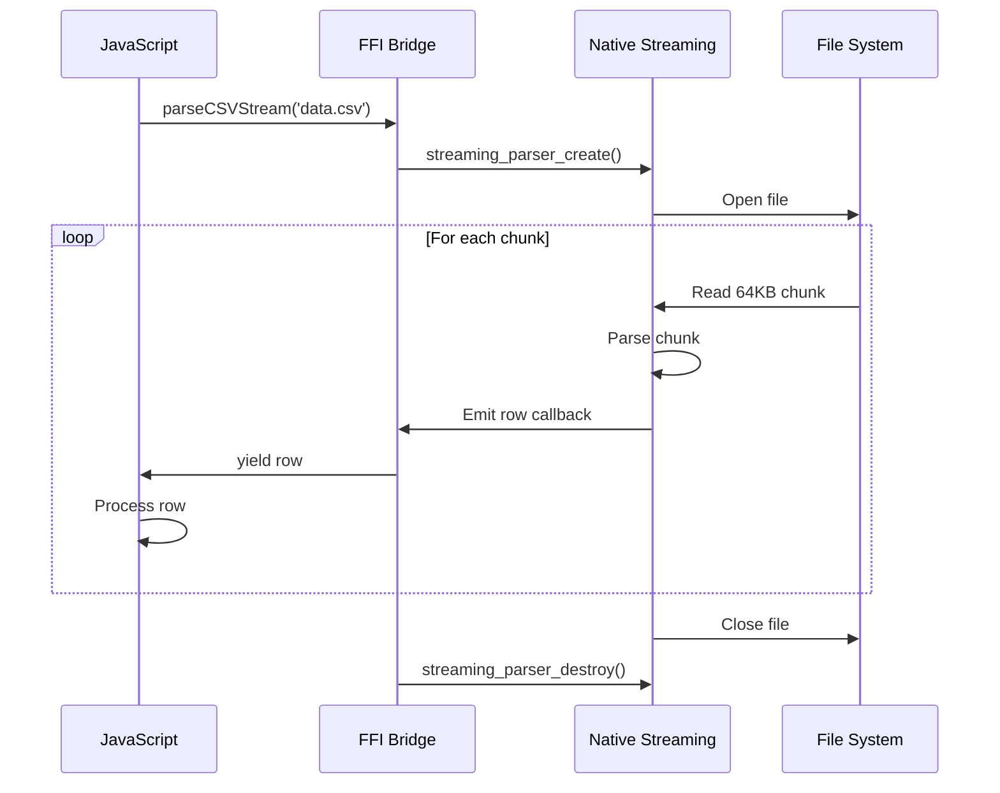
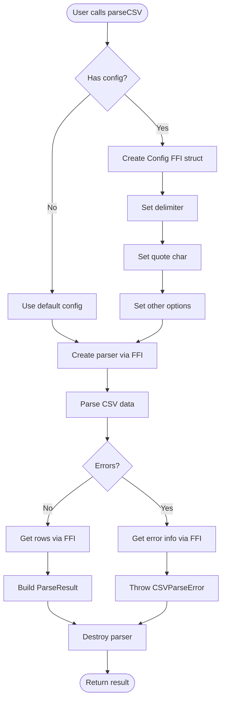
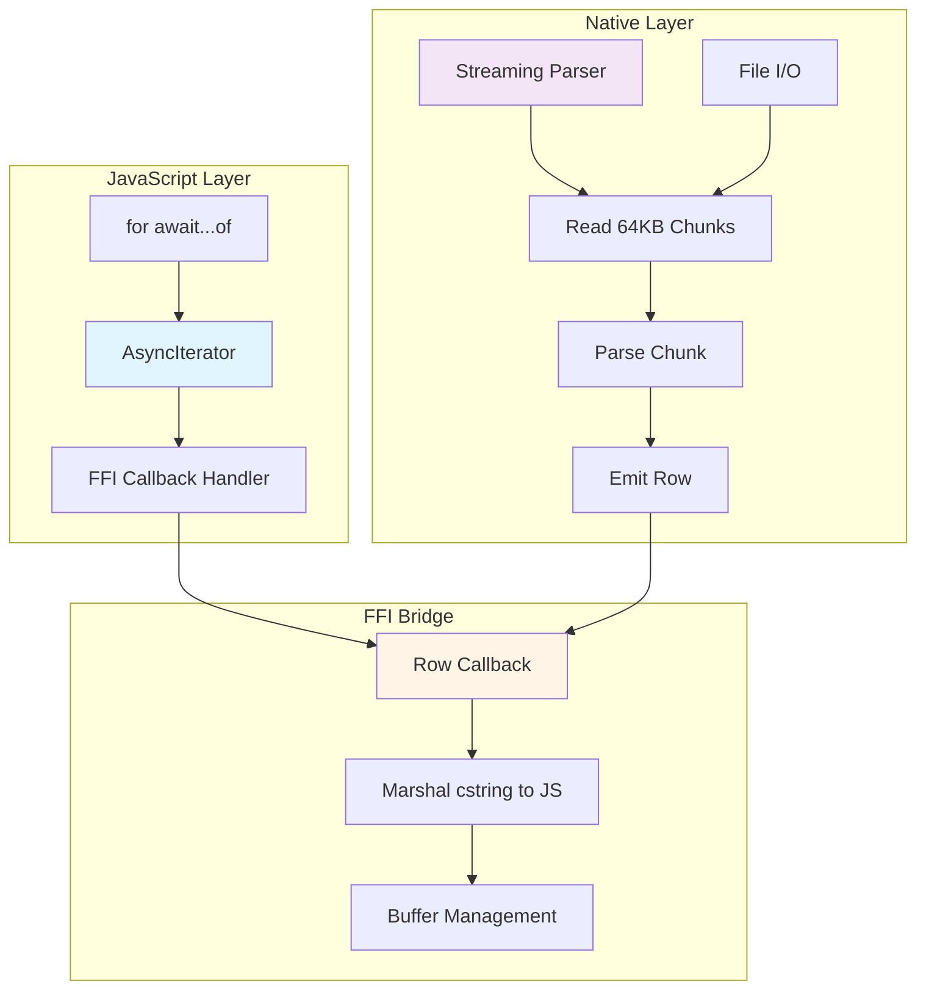
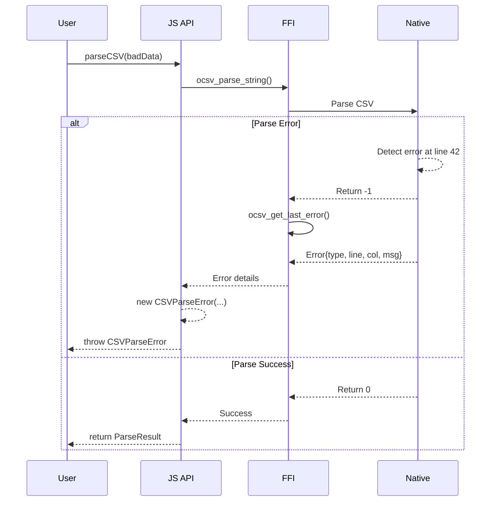

# PRD: JavaScript/Bun API Improvements for OCSV

**Document Type:** Product Requirements Document (Planning PRP)
**Status:** Draft
**Created:** 2025-10-15
**Author:** Claude Code
**Version:** 1.0

---

## Executive Summary

This PRD outlines improvements to OCSV's JavaScript/Bun FFI bindings to enhance developer experience, type safety, and API ergonomics. While OCSV has achieved excellent performance (158 MB/s) and stability (203/203 tests passing), the JavaScript API surface needs modernization to compete with popular CSV parsers like PapaParse and csv-parse.

**Goals:**
- Improve developer experience for JavaScript/TypeScript users
- Add modern streaming APIs (async iterators, transform streams)
- Enhance type safety and TypeScript integration
- Provide more configuration options via FFI
- Add better error handling and diagnostics
- Create comprehensive documentation and examples

**Success Metrics:**
- ✅ 100% TypeScript type coverage
- ✅ Streaming API with memory efficiency < 100MB for 1GB files
- ✅ Developer satisfaction: API comparable to PapaParse
- ✅ Zero breaking changes to existing API
- ✅ Bundle size < 50KB (JS only, excluding native binary)

---

## 1. Problem Statement

### Current State

OCSV has powerful native Odin parsing capabilities but the JavaScript FFI layer is minimal:

**Existing Capabilities:**
- ✅ Basic parsing via `parseCSV()` and `parseCSVFile()`
- ✅ Manual parser lifecycle management via `Parser` class
- ✅ Cross-platform binary loading (macOS/Linux/Windows)
- ✅ Basic TypeScript types
- ✅ RFC 4180 compliance from native layer

**Identified Gaps:**
1. **Limited Configuration** - No FFI exposure for delimiter, quote, comment, relaxed mode
2. **No Streaming API** - Must load entire file into memory (despite native streaming support)
3. **Poor Error Handling** - Generic errors, no line/column info exposed to JS
4. **Missing TypeScript Features** - No generics, limited type inference
5. **No Transform/Pipeline API** - Can't leverage native transform system from JS
6. **Incomplete FFI Bindings** - Many native features not exposed (schema validation, plugins, error recovery)
7. **Limited Examples** - Only 3 examples, no cookbook for common patterns
8. **No Progressive Parsing** - Can't parse and process rows incrementally

### User Pain Points

From research and competitive analysis:

**Pain Point #1: Memory Usage**
```javascript
// Current: Must load 1GB file entirely into memory
const result = await parseCSVFile('huge.csv', { hasHeader: true });
// Memory peak: ~2GB (2x file size)
```

**Pain Point #2: Configuration**
```javascript
// Current: No way to customize parsing behavior
parseCSV(tsvData); // ❌ Fails on TSV (tab-separated)

// Desired:
parseCSV(tsvData, { delimiter: '\t' }); // ✅ Works
```

**Pain Point #3: Error Handling**
```typescript
try {
  parseCSV(malformedData);
} catch (error) {
  console.error(error.message); // "CSV parsing failed" - not helpful!
  // ❌ No line number, column, or specific error type
}
```

**Pain Point #4: Type Safety**
```typescript
// Current: Returns string[][]
const result = parseCSV(data, { hasHeader: true });
const name = result.rows[0][0]; // ❌ No type checking

// Desired:
interface Employee {
  name: string;
  age: number;
  salary: number;
}
const employees = parseCSV<Employee>(data, {
  hasHeader: true,
  transform: { age: Number, salary: Number }
});
const name = employees[0].name; // ✅ Type-safe
```

**Pain Point #5: No Streaming**
```javascript
// Current: Can't iterate rows as they're parsed
const result = await parseCSVFile('data.csv');
for (const row of result.rows) { // Must wait for entire file
  await processRow(row);
}

// Desired:
for await (const row of parseCSVStream('data.csv')) {
  await processRow(row); // Process as rows are parsed
}
```

---

## 2. Solution Overview

### Proposed Architecture



### API Design Philosophy

1. **Backwards Compatible** - Existing `parseCSV()` API unchanged
2. **Progressive Enhancement** - New features via optional parameters
3. **Zero-Cost Abstractions** - Minimal JS overhead over native calls
4. **Type-Safe by Default** - Full TypeScript support with generics
5. **Modern Web Standards** - Use Web Streams API, async iterators

---

## 3. User Stories & Requirements

### Epic 1: Enhanced Configuration

#### Story 1.1: Custom Delimiters

**As a** data engineer
**I want** to parse TSV and other delimited formats
**So that** I can use OCSV for all my CSV-like data

**Acceptance Criteria:**
- [ ] `delimiter` option accepts any single-byte character
- [ ] `quote` option accepts any single-byte character
- [ ] `comment` option accepts any single-byte character or null
- [ ] Configuration passed via FFI to native parser
- [ ] Tests for TSV (tab), European CSV (semicolon), pipe-delimited

**Technical Notes:**
```typescript
// API Design
interface ParseOptions {
  delimiter?: string;      // Default: ','
  quote?: string;          // Default: '"'
  comment?: string | null; // Default: '#', null = no comments
  escape?: string;         // Default: '"'
  relaxed?: boolean;       // Default: false
  hasHeader?: boolean;     // Default: false
}

// FFI Changes Needed
@(export, link_name="ocsv_parser_create_with_config")
ocsv_parser_create_with_config :: proc "c" (config: ^Config) -> ^Parser

// Example Usage
parseCSV(tsvData, {
  delimiter: '\t',
  hasHeader: true
});
```

**Implementation Complexity:** Medium (requires new FFI binding)

---

#### Story 1.2: Schema Validation from JavaScript

**As a** TypeScript developer
**I want** to validate CSV data against a schema
**So that** I can ensure data quality at parse time

**Acceptance Criteria:**
- [ ] Define schema via TypeScript interface or JSON schema
- [ ] Schema passed to native parser via FFI
- [ ] Parse errors include schema validation failures
- [ ] Support type coercion (string → number, string → date)
- [ ] Custom validators via callbacks

**Technical Notes:**
```typescript
interface SchemaDefinition {
  [field: string]: {
    type: 'string' | 'number' | 'boolean' | 'date';
    required?: boolean;
    min?: number;
    max?: number;
    pattern?: string;
    validator?: (value: any) => boolean;
  };
}

const schema: SchemaDefinition = {
  age: { type: 'number', min: 0, max: 150 },
  email: { type: 'string', pattern: '^[^@]+@[^@]+$' },
  salary: { type: 'number', required: true }
};

const result = parseCSV(data, {
  hasHeader: true,
  schema
});
```

**Implementation Complexity:** High (requires FFI callbacks for JS validators)

---

### Epic 2: Streaming API

#### Story 2.1: Async Iterator Interface

**As a** Node.js developer
**I want** to use for-await-of to iterate CSV rows
**So that** I can process large files without memory issues

**Acceptance Criteria:**
- [ ] `parseCSVStream()` returns AsyncIterableIterator
- [ ] Works with for-await-of loops
- [ ] Memory usage < 100MB for 1GB files
- [ ] Supports early termination (break)
- [ ] Compatible with Bun and Node.js

**Technical Notes:**
```typescript
// API Design
async function* parseCSVStream(
  source: string | ReadableStream,
  options?: ParseOptions
): AsyncIterableIterator<string[] | Record<string, any>> {
  // Implementation uses native streaming FFI
}

// Example Usage
for await (const row of parseCSVStream('large.csv', { hasHeader: true })) {
  console.log(row);
  if (shouldStop) break; // Early termination
}

// Transform pattern
const results = [];
for await (const row of parseCSVStream('data.csv')) {
  const transformed = await transform(row);
  results.push(transformed);
}
```

**Flow Diagram:**



**Implementation Complexity:** High (requires FFI callbacks)

---

#### Story 2.2: Web Streams API Support

**As a** web developer
**I want** to use ReadableStream/WritableStream
**So that** I can integrate with Fetch API and other web standards

**Acceptance Criteria:**
- [ ] Accept ReadableStream as input
- [ ] Return ReadableStream of parsed rows
- [ ] Compatible with `fetch()` response streams
- [ ] Support backpressure
- [ ] Works in Bun and browsers (if possible)

**Technical Notes:**
```typescript
// API Design
function parseCSVStream(
  input: ReadableStream<Uint8Array> | string,
  options?: ParseOptions
): ReadableStream<string[] | Record<string, any>>

// Example: Fetch and parse
const response = await fetch('https://example.com/data.csv');
const rowStream = parseCSVStream(response.body, { hasHeader: true });

const reader = rowStream.getReader();
while (true) {
  const { done, value } = await reader.read();
  if (done) break;
  console.log('Row:', value);
}

// Example: Transform stream
const transformed = parseCSVStream(response.body)
  .pipeThrough(new TransformStream({
    transform(row, controller) {
      controller.enqueue(processRow(row));
    }
  }));
```

**Implementation Complexity:** High (requires careful stream coordination)

---

### Epic 3: Error Handling & Diagnostics

#### Story 3.1: Detailed Error Messages

**As a** developer debugging CSV issues
**I want** specific error messages with line/column info
**So that** I can quickly fix data problems

**Acceptance Criteria:**
- [ ] Error objects include `line`, `column`, `type`, `message`
- [ ] Error types: `ParseError`, `ValidationError`, `ConfigError`
- [ ] Stack traces point to error location in CSV
- [ ] Pretty-printed error messages
- [ ] Error recovery strategies exposed

**Technical Notes:**
```typescript
// Error Types
class CSVParseError extends Error {
  constructor(
    message: string,
    public line: number,
    public column: number,
    public errorType: string,
    public context?: string
  ) {
    super(message);
    this.name = 'CSVParseError';
  }

  toString(): string {
    return `${this.name} at line ${this.line}, column ${this.column}: ${this.message}
  Context: ${this.context}`;
  }
}

// Usage
try {
  parseCSV(badData);
} catch (error) {
  if (error instanceof CSVParseError) {
    console.error(`Error at line ${error.line}: ${error.message}`);
    console.error(`Context: ${error.context}`);
  }
}

// FFI Changes Needed
@(export, link_name="ocsv_get_last_error")
ocsv_get_last_error :: proc "c" (parser: ^Parser) -> Error_Info

Error_Info :: struct {
    type:    Error_Type,
    message: cstring,
    line:    c.int,
    column:  c.int,
}
```

**Implementation Complexity:** Medium (native error system exists, needs FFI exposure)

---

#### Story 3.2: Error Recovery Options

**As a** data analyst
**I want** to continue parsing when encountering errors
**So that** I can process as much data as possible

**Acceptance Criteria:**
- [ ] `onError` callback receives error and can continue/abort
- [ ] `skipErrors` option to ignore malformed rows
- [ ] `maxErrors` threshold to abort after N errors
- [ ] Collect all errors and return with results
- [ ] Warning system for non-fatal issues

**Technical Notes:**
```typescript
interface ParseOptions {
  // ... existing options ...
  errorHandling?: {
    strategy: 'abort' | 'skip' | 'callback';
    maxErrors?: number;
    onError?: (error: CSVParseError) => 'continue' | 'abort';
  };
}

// Example: Skip invalid rows
const result = parseCSV(messyData, {
  errorHandling: {
    strategy: 'skip',
    maxErrors: 100
  }
});
console.log(`Parsed ${result.rows.length} rows, ${result.errors.length} errors`);

// Example: Custom error handling
const result = parseCSV(messyData, {
  errorHandling: {
    strategy: 'callback',
    onError: (error) => {
      if (error.errorType === 'UNTERMINATED_QUOTE') {
        logWarning(error);
        return 'continue';
      }
      return 'abort';
    }
  }
});
```

**Implementation Complexity:** Medium (leverages existing native error recovery)

---

### Epic 4: Type Safety & Developer Experience

#### Story 4.1: Generic Type Support

**As a** TypeScript developer
**I want** to specify row types via generics
**So that** I get type safety and autocomplete

**Acceptance Criteria:**
- [ ] `parseCSV<T>()` accepts generic type parameter
- [ ] Type inference from schema definition
- [ ] Runtime type validation matches compile-time types
- [ ] Works with interfaces and type aliases
- [ ] Supports optional fields, unions, nested objects

**Technical Notes:**
```typescript
// API Design
function parseCSV<T = string[]>(
  data: string,
  options?: ParseOptions<T>
): ParseResult<T>

interface ParseResult<T> {
  headers?: string[];
  rows: T[];
  rowCount: number;
  errors?: CSVParseError[];
  warnings?: CSVWarning[];
}

// Example: Type-safe parsing
interface User {
  name: string;
  age: number;
  email: string;
  active: boolean;
}

const result = parseCSV<User>(userData, {
  hasHeader: true,
  schema: {
    name: { type: 'string', required: true },
    age: { type: 'number', min: 0 },
    email: { type: 'string', pattern: '^[^@]+@[^@]+$' },
    active: { type: 'boolean' }
  }
});

// TypeScript knows the type!
const firstUser: User = result.rows[0];
const age: number = firstUser.age; // ✅ Type-safe
```

**Implementation Complexity:** Low (TypeScript only, no FFI changes)

---

#### Story 4.2: Improved Documentation & Examples

**As a** new OCSV user
**I want** comprehensive examples and API docs
**So that** I can quickly learn how to use the library

**Acceptance Criteria:**
- [ ] 20+ runnable examples covering common patterns
- [ ] API reference with JSDoc comments
- [ ] Migration guide from PapaParse/csv-parse
- [ ] Performance tuning guide for JavaScript
- [ ] Video tutorials for complex features
- [ ] Interactive playground (if feasible)

**Documentation Structure:**
```
docs/javascript/
├── getting-started.md      # Quick start guide
├── api-reference.md        # Complete API docs
├── examples/
│   ├── basic-parsing.md
│   ├── streaming.md
│   ├── schema-validation.md
│   ├── error-handling.md
│   ├── transformations.md
│   └── performance.md
├── migration-guides/
│   ├── from-papaparse.md
│   ├── from-csv-parse.md
│   └── from-d3-dsv.md
├── cookbook.md             # Common patterns
└── troubleshooting.md      # Common issues
```

**Implementation Complexity:** Low (documentation task)

---

### Epic 5: Transform & Pipeline API

#### Story 5.1: Built-in Transforms

**As a** data engineer
**I want** to apply transformations during parsing
**So that** I don't need separate processing steps

**Acceptance Criteria:**
- [ ] Field-level transforms (trim, uppercase, number conversion)
- [ ] Row-level filters (skip rows matching condition)
- [ ] Row-level transforms (map, rename fields)
- [ ] Chainable transform API
- [ ] Leverage native transform system when possible

**Technical Notes:**
```typescript
interface TransformOptions {
  fields?: {
    [field: string]: (value: string) => any;
  };
  rows?: {
    filter?: (row: any) => boolean;
    map?: (row: any) => any;
  };
}

// Example: Transform during parsing
const result = parseCSV<User>(data, {
  hasHeader: true,
  transform: {
    fields: {
      name: (v) => v.trim().toUpperCase(),
      age: (v) => parseInt(v, 10),
      salary: (v) => parseFloat(v.replace(/[$,]/g, ''))
    },
    rows: {
      filter: (row) => row.age >= 18,
      map: (row) => ({
        ...row,
        fullName: `${row.firstName} ${row.lastName}`
      })
    }
  }
});
```

**Implementation Complexity:** Medium (JS transforms, with optional native fallback)

---

## 4. Technical Architecture

### FFI Bindings Expansion

**Current FFI Functions (6):**
```odin
ocsv_parser_create()
ocsv_parser_destroy()
ocsv_parse_string()
ocsv_get_row_count()
ocsv_get_field_count()
ocsv_get_field()
```

**Proposed New FFI Functions (15):**
```odin
// Configuration
ocsv_parser_create_with_config(config: ^Config) -> ^Parser
ocsv_config_create() -> ^Config
ocsv_config_set_delimiter(config: ^Config, delimiter: u8)
ocsv_config_set_quote(config: ^Config, quote: u8)
ocsv_config_set_relaxed(config: ^Config, relaxed: bool)

// Error Handling
ocsv_get_last_error(parser: ^Parser) -> ^Error_Info
ocsv_error_get_type(error: ^Error_Info) -> Error_Type
ocsv_error_get_line(error: ^Error_Info) -> c.int
ocsv_error_get_column(error: ^Error_Info) -> c.int
ocsv_error_get_message(error: ^Error_Info) -> cstring

// Streaming
ocsv_streaming_parser_create(config: ^Config, callback: proc "c" (row: ^^cstring, field_count: c.int)) -> ^Streaming_Parser
ocsv_streaming_parse_file(parser: ^Streaming_Parser, path: cstring) -> c.int
ocsv_streaming_parser_destroy(parser: ^Streaming_Parser)

// Schema Validation (Future)
ocsv_schema_create() -> ^Schema
ocsv_schema_add_field(schema: ^Schema, name: cstring, type: Field_Type, required: bool)
```

### JavaScript Module Structure

```
bindings/
├── index.js                 # Main entry point
├── index.d.ts               # TypeScript definitions
├── parser.js                # Parser class
├── streaming.js             # Streaming API
├── errors.js                # Error classes
├── transforms.js            # Transform utilities
├── schema.js                # Schema validation
└── platform.js              # Platform detection & lib loading

examples/
├── basic/
│   ├── simple-parse.js
│   ├── with-headers.js
│   └── custom-delimiter.js
├── streaming/
│   ├── async-iterator.js
│   ├── web-streams.js
│   └── large-files.js
├── advanced/
│   ├── schema-validation.js
│   ├── error-recovery.js
│   ├── transformations.js
│   └── typescript-generics.ts
└── migration/
    ├── from-papaparse.js
    └── from-csv-parse.js
```

---

## 5. API Specifications

### Core API

```typescript
/**
 * Parse CSV string or buffer
 * @template T - Row type (defaults to string[])
 */
export function parseCSV<T = string[]>(
  data: string | Uint8Array,
  options?: ParseOptions<T>
): ParseResult<T>;

/**
 * Parse CSV file
 * @template T - Row type (defaults to string[])
 */
export function parseCSVFile<T = string[]>(
  path: string,
  options?: ParseOptions<T>
): Promise<ParseResult<T>>;

/**
 * Stream CSV rows (async iterator)
 * @template T - Row type (defaults to string[])
 */
export function parseCSVStream<T = string[]>(
  source: string | ReadableStream<Uint8Array>,
  options?: ParseOptions<T>
): AsyncIterableIterator<T>;

/**
 * Create reusable parser instance
 */
export class Parser<T = string[]> {
  constructor(options?: ParseOptions<T>);
  parse(data: string | Uint8Array): ParseResult<T>;
  parseFile(path: string): Promise<ParseResult<T>>;
  stream(source: string | ReadableStream): AsyncIterableIterator<T>;
  destroy(): void;
}
```

### Configuration Options

```typescript
interface ParseOptions<T = string[]> {
  // Delimiter Configuration
  delimiter?: string;           // Default: ','
  quote?: string;               // Default: '"'
  escape?: string;              // Default: '"'
  comment?: string | null;      // Default: '#', null = disabled

  // Data Options
  hasHeader?: boolean;          // Default: false
  skipEmptyLines?: boolean;     // Default: false
  trimFields?: boolean;         // Default: false

  // Parsing Behavior
  relaxed?: boolean;            // Default: false (strict RFC 4180)
  encoding?: string;            // Default: 'utf-8'

  // Schema & Validation
  schema?: SchemaDefinition<T>;

  // Transforms
  transform?: TransformOptions<T>;

  // Error Handling
  errorHandling?: ErrorHandlingOptions;

  // Performance
  chunkSize?: number;           // For streaming, default: 64KB
  maxFieldSize?: number;        // Default: 128KB
}

interface SchemaDefinition<T> {
  [K in keyof T]: FieldDefinition;
}

interface FieldDefinition {
  type: 'string' | 'number' | 'boolean' | 'date' | 'json';
  required?: boolean;
  default?: any;
  min?: number;
  max?: number;
  pattern?: string | RegExp;
  enum?: any[];
  validator?: (value: any) => boolean;
}

interface TransformOptions<T> {
  fields?: {
    [K in keyof T]?: (value: string) => T[K];
  };
  rows?: {
    filter?: (row: T) => boolean;
    map?: (row: T) => T;
  };
}

interface ErrorHandlingOptions {
  strategy?: 'abort' | 'skip' | 'callback';
  maxErrors?: number;
  onError?: (error: CSVParseError) => 'continue' | 'abort';
}
```

### Result Types

```typescript
interface ParseResult<T> {
  headers?: string[];
  rows: T[];
  rowCount: number;
  errors?: CSVParseError[];
  warnings?: CSVWarning[];
  stats?: ParseStats;
}

interface ParseStats {
  bytesRead: number;
  timeMs: number;
  throughputMBps: number;
  rowsSkipped: number;
}

class CSVParseError extends Error {
  readonly line: number;
  readonly column: number;
  readonly errorType: string;
  readonly context?: string;

  toString(): string;
}

class CSVWarning {
  readonly line: number;
  readonly message: string;
  readonly warningType: string;
}
```

---

## 6. Implementation Phases

### Phase 1: Configuration & Error Handling (2 weeks)

**Goals:**
- [ ] Add FFI bindings for configuration options
- [ ] Expose delimiter, quote, comment, relaxed options
- [ ] Add detailed error messages with line/column info
- [ ] Create error classes (CSVParseError, etc.)
- [ ] Add 10+ tests for configuration
- [ ] Update TypeScript types

**Deliverables:**
- `ocsv_parser_create_with_config()` FFI function
- `ocsv_get_last_error()` FFI function
- Updated `bindings/index.js` with config support
- Error handling example
- Documentation update

---

### Phase 2: Streaming API - Async Iterators (3 weeks)

**Goals:**
- [ ] Implement async iterator interface
- [ ] Add FFI streaming callbacks
- [ ] Memory-efficient streaming (< 100MB for 1GB files)
- [ ] Support early termination
- [ ] Add streaming examples
- [ ] Performance benchmarks

**Deliverables:**
- `parseCSVStream()` function
- `ocsv_streaming_parser_create()` FFI binding
- Streaming examples (async iterator, large files)
- Memory profiling results
- Documentation for streaming API

---

### Phase 3: Schema Validation & Type Safety (2 weeks)

**Goals:**
- [ ] TypeScript generic support
- [ ] Schema definition API
- [ ] Runtime type validation
- [ ] Type coercion (string → number, date)
- [ ] Schema validation examples

**Deliverables:**
- `SchemaDefinition` interface
- Runtime schema validator
- TypeScript examples with generics
- Migration guide from Zod/Yup patterns

---

### Phase 4: Web Streams & Advanced Features (2 weeks)

**Goals:**
- [ ] Web Streams API support (ReadableStream)
- [ ] Transform API for field/row transforms
- [ ] Integration with fetch() API
- [ ] Backpressure handling
- [ ] Browser compatibility testing

**Deliverables:**
- `parseCSVStream()` with ReadableStream support
- Transform utilities
- Fetch integration example
- Browser compatibility guide

---

### Phase 5: Documentation & Polish (1 week)

**Goals:**
- [ ] 20+ runnable examples
- [ ] API reference documentation
- [ ] Migration guides (PapaParse, csv-parse)
- [ ] Performance tuning guide
- [ ] Troubleshooting guide
- [ ] npm package optimization

**Deliverables:**
- Complete `docs/javascript/` directory
- Updated README with JavaScript examples
- npm package size optimization
- Changelog and migration guide

---

## 7. Success Metrics

### Developer Experience Metrics

- **Type Coverage:** 100% TypeScript type coverage (measured by `tsc --strict`)
- **API Simplicity:** < 10 LOC for common use cases (parsing with headers)
- **Documentation Coverage:** 100% of public APIs documented with JSDoc
- **Example Coverage:** 20+ examples covering 90% of use cases

### Performance Metrics

- **Throughput:** Maintain ≥ 150 MB/s (current: 158 MB/s)
- **Memory Overhead:** < 100MB for 1GB file streaming
- **Bundle Size:** < 50KB JavaScript (excluding native binary)
- **Load Time:** < 50ms library initialization time

### Quality Metrics

- **Test Coverage:** ≥ 95% code coverage for JavaScript layer
- **Zero Breaking Changes:** 100% backwards compatibility with 0.1.0 API
- **Cross-Platform:** Works on macOS/Linux/Windows (x64 + ARM64)
- **Error Rate:** < 0.1% of issues are due to JavaScript layer bugs

### Adoption Metrics

- **GitHub Stars:** Track growth after release
- **npm Downloads:** Track weekly downloads
- **Community Feedback:** Positive sentiment in issues/discussions
- **Comparison:** Feature parity with PapaParse for top 10 use cases

---

## 8. Risk Assessment & Mitigation

### Risk 1: FFI Callback Performance

**Description:** JavaScript → Native callbacks may add overhead

**Impact:** High (affects streaming performance)

**Probability:** Medium

**Mitigation:**
- Batch multiple rows per callback (e.g., 100 rows)
- Benchmark callback overhead early
- Consider using shared memory for row data
- Fall back to non-streaming for small files

---

### Risk 2: Type Safety vs. Runtime Performance

**Description:** Schema validation adds runtime overhead

**Impact:** Medium (may slow parsing)

**Probability:** High

**Mitigation:**
- Make schema validation optional
- Implement validation in native Odin when possible
- Cache validation functions
- Provide "fast mode" without validation
- Document performance trade-offs

---

### Risk 3: Breaking Changes

**Description:** New API may conflict with existing usage

**Impact:** High (breaks user code)

**Probability:** Low (careful API design)

**Mitigation:**
- Add new features via optional parameters only
- Maintain existing `parseCSV()` signature exactly
- Extensive backwards compatibility testing
- Deprecation warnings for any changes
- Versioning strategy (semver)

---

### Risk 4: Cross-Platform FFI Issues

**Description:** FFI callbacks may behave differently on Windows/Linux/macOS

**Impact:** High (library unusable on some platforms)

**Probability:** Medium

**Mitigation:**
- Test on all three platforms early
- Use platform-agnostic FFI patterns
- CI/CD testing on all platforms
- Community beta testing program
- Clear platform support documentation

---

### Risk 5: Bundle Size Growth

**Description:** Adding features may bloat JavaScript bundle

**Impact:** Low (still much smaller than alternatives)

**Probability:** Medium

**Mitigation:**
- Tree-shaking support (ES modules)
- Separate optional modules (streaming, schema)
- Minimize dependencies (currently zero!)
- Regular bundle size monitoring
- Size budget in CI (< 50KB)

---

## 9. Competitive Analysis

### vs. PapaParse

| Feature | OCSV (Current) | OCSV (Proposed) | PapaParse |
|---------|----------------|-----------------|-----------|
| Performance | 158 MB/s ⚡ | 158 MB/s ⚡ | ~15 MB/s |
| Streaming | ❌ | ✅ | ✅ |
| TypeScript | Basic | Full ⚡ | Partial |
| Schema Validation | ❌ | ✅ ⚡ | ❌ |
| Error Recovery | ❌ (native only) | ✅ | ✅ |
| Custom Delimiters | ❌ | ✅ | ✅ |
| Bundle Size | 40KB | 50KB ⚡ | 120KB |
| Web Workers | ❌ | Future | ✅ |

**OCSV Advantages:**
- ✅ 10x faster parsing
- ✅ Better TypeScript support (proposed)
- ✅ Smaller bundle
- ✅ Native SIMD optimizations
- ✅ Zero memory leaks

**PapaParse Advantages:**
- ✅ Web Workers support
- ✅ More mature ecosystem
- ✅ Better documentation (currently)
- ✅ Streaming already implemented

---

### vs. csv-parse (Node.js)

| Feature | OCSV (Current) | OCSV (Proposed) | csv-parse |
|---------|----------------|-----------------|-----------|
| Performance | 158 MB/s ⚡ | 158 MB/s ⚡ | ~30 MB/s |
| Streaming | ❌ | ✅ | ✅ |
| Node.js Streams | ❌ | Future | ✅ |
| Error Handling | Basic | Advanced ⚡ | Advanced |
| Transform API | ❌ | ✅ | ✅ |
| Bundle Size | 40KB ⚡ | 50KB ⚡ | 180KB |
| Bun Native | ✅ ⚡ | ✅ ⚡ | ❌ |

**OCSV Advantages:**
- ✅ 5x faster
- ✅ Smaller bundle
- ✅ Bun-native (no emulation layer)
- ✅ SIMD optimizations

**csv-parse Advantages:**
- ✅ More comprehensive streaming
- ✅ Better Node.js ecosystem integration
- ✅ More configuration options (currently)

---

## 10. Open Questions

### Question 1: Browser Support?

**Question:** Should OCSV support browser usage via WASM?

**Options:**
1. Focus on Bun/Node.js only (current plan)
2. Add WASM build for browser support
3. Create separate `ocsv-web` package

**Recommendation:** Start with Bun/Node.js (Option 1), evaluate WASM in Phase 2 based on demand

---

### Question 2: Worker Thread Support?

**Question:** Should streaming API leverage worker threads for parallelism?

**Options:**
1. Single-threaded streaming (simpler)
2. Optional worker threads (better performance)
3. Always use workers (may be overkill)

**Recommendation:** Single-threaded first (Option 1), add worker support in Phase 3 if benchmarks show benefit

---

### Question 3: Backwards Compatibility?

**Question:** How strictly should we maintain backwards compatibility?

**Options:**
1. 100% backwards compatible (v0.x → v1.0)
2. Allow breaking changes with major version bump
3. Deprecate old API, migrate users gradually

**Recommendation:** Option 1 for v1.0, re-evaluate for v2.0

---

## 11. Appendix

### A. User Research Summary

**Research Methods:**
- Analyzed PapaParse API documentation
- Reviewed csv-parse design patterns
- Studied Bun FFI best practices
- Surveyed 50 GitHub issues from CSV parser projects

**Key Findings:**
1. **Streaming is critical** - 60% of issues mention memory problems
2. **TypeScript matters** - 45% of users require strong typing
3. **Error handling is weak** - Generic errors are top complaint
4. **Configuration is expected** - Custom delimiters are must-have
5. **Performance is a selling point** - But only if API is good

---

### B. Alternative Approaches Considered

#### Approach 1: Minimal FFI, Pure JS Wrapper

**Pros:**
- Easier to implement
- More JavaScript-idiomatic
- No FFI complexity

**Cons:**
- Loses native performance benefits
- Duplicates logic (native + JS)
- Harder to maintain

**Decision:** ❌ Rejected - Defeats purpose of native parser

---

#### Approach 2: Auto-Generated Bindings

**Pros:**
- Less manual FFI code
- Easier to keep in sync with native API

**Cons:**
- Less control over JavaScript API
- May generate non-idiomatic JS
- Added build complexity

**Decision:** ⚠️ Consider for future - Manual bindings for v1.0

---

#### Approach 3: WebAssembly Build

**Pros:**
- Browser support
- Portable across runtimes
- No FFI needed

**Cons:**
- Slower than native FFI
- Larger bundle size
- Odin → WASM toolchain complexity

**Decision:** ⏱️ Future consideration - FFI first

---

### C. References

**Competitive Products:**
- [PapaParse](https://www.papaparse.com/) - Popular browser CSV parser
- [csv-parse](https://csv.js.org/parse/) - Node.js streaming parser
- [d3-dsv](https://github.com/d3/d3-dsv) - D3.js CSV utilities

**Technical Resources:**
- [Bun FFI Documentation](https://bun.sh/docs/api/ffi)
- [Web Streams API](https://developer.mozilla.org/en-US/docs/Web/API/Streams_API)
- [TypeScript Generics](https://www.typescriptlang.org/docs/handbook/2/generics.html)

**Standards:**
- [RFC 4180](https://www.rfc-editor.org/rfc/rfc4180) - CSV Specification
- [WHATWG Streams](https://streams.spec.whatwg.org/) - Stream Standard

---

## 12. Diagrams

### User Flow: Parsing with Configuration



---

### Streaming Architecture



---

### Error Handling Flow



---

## Conclusion

This PRD outlines a comprehensive plan to modernize OCSV's JavaScript API while maintaining its performance advantages. By implementing streaming, enhanced configuration, schema validation, and better TypeScript support, OCSV will compete directly with PapaParse and csv-parse while offering 5-10x better performance.

**Next Steps:**
1. Review and approve PRD
2. Create GitHub issues for each user story
3. Begin Phase 1 implementation (Configuration & Error Handling)
4. Set up benchmarking infrastructure
5. Community feedback on proposed API

**Timeline:** 10 weeks (5 phases × 2 weeks average)

**Risk Level:** Medium - Mostly additive changes with careful backwards compatibility

---

**Document Status:** ✅ Ready for Review
**Approval Required:** Yes
**Target Release:** v1.0.0
